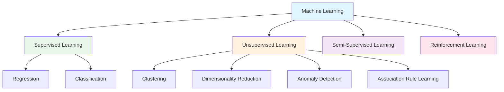
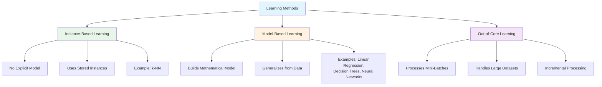
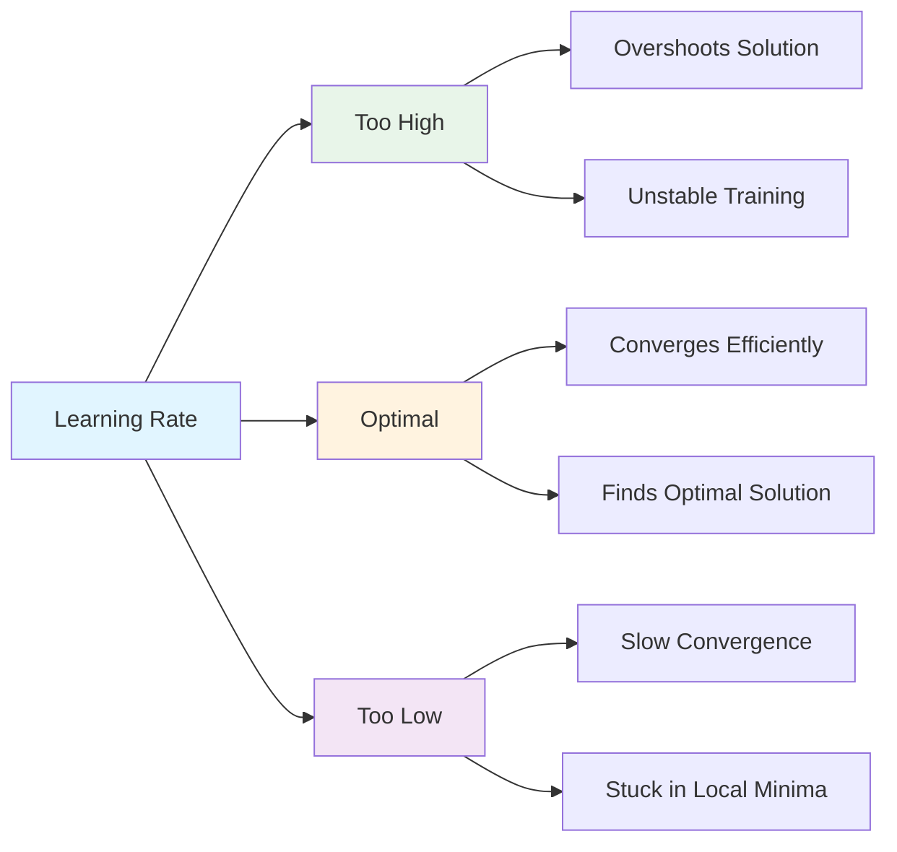

## Machine Learning

`Machine Learning (ML)` is a subset of Artificial Intelligence (AI) that enables systems to automatically learn patterns from data and improve their performance on a task without being explicitly programmed.

`Deep Learning (DL)` is a specialized branch of ML that uses multi-layered `Artificial Neural Networks (ANNs)` to learn complex data representations.  
`Architecture:` Input Layer → One or More Hidden Layers → Output Layer

### Types of Machine Learning

#### 1. Supervised Learning
Learns from `labeled data`, where both inputs and corresponding outputs are known.

- `Regression:` Predicts continuous numerical values (e.g., price, temperature).  
- `Classification:` Predicts discrete class labels (e.g., spam vs. not spam).

#### 2. Unsupervised Learning
Learns from `unlabeled data` by identifying hidden patterns or structures.

- `Clustering:` Groups similar data points (e.g., customer segmentation).  
- `Dimensionality Reduction:` Reduces features while retaining essential information (e.g., PCA).  
- `Anomaly Detection:` Detects rare or unusual data points (outliers).  
- `Association Rule Learning:` Finds relationships or co-occurrences between variables (e.g., market basket analysis).

#### 3. Semi-Supervised Learning
Uses a `small amount of labeled data` combined with a `large amount of unlabeled data` to improve model accuracy and reduce labeling cost.

#### 4. Reinforcement Learning
An `agent` interacts with an `environment` by performing `actions` and learning from `feedback` in the form of rewards or penalties.  
Goal: maximize cumulative reward over time through trial and error.

### Learning Strategies

#### Batch (Offline) Machine Learning
- Trains on the `entire dataset at once`, then deployed for predictions.  
- Requires `periodic retraining` to stay up to date with new data.  
- `Drawbacks:` high hardware usage, downtime during retraining, limited adaptability to real-time changes.

#### Online (Incremental) Machine Learning
- Starts with an initial model and `continuously learns` from new incoming data.  
- `Advantages:` adapts to `concept drift`, cost-effective, enables real-time updates and predictions.

### Learning Methods

- `Instance-Based Learning:`  
  Compares new data points with existing examples and makes predictions based on similarity (e.g., *k-Nearest Neighbors*).  
  No explicit model is trained; decisions rely on stored instances.

- `Model-Based Learning:`  
  Builds a `mathematical relationship` between inputs and outputs (e.g., *Linear Regression*, *Decision Trees*, *Neural Networks*).  
  The model generalizes from data and can make predictions on unseen inputs.

- `Out-of-Core Learning:`  
  Used when datasets are too large to fit in memory; data is processed incrementally in `mini-batches`.  
  - `Challenges:` requires careful implementation to avoid data inconsistency and maintain training stability.

#### Key Concept

`Learning Rate:`  
Determines how quickly a model updates its parameters during training.  
- Too high → may overshoot the optimal solution.  
- Too low → may converge slowly or get stuck in local minima.

