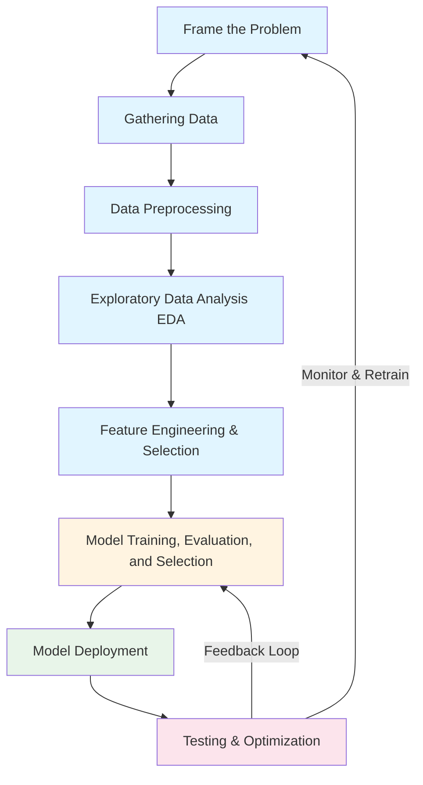

## Machine Learning Overview

### Challenges in Machine Learning

Machine Learning projects face several real-world challenges that impact model performance, scalability, and deployment.

#### 1. Data Challenges
- `Collecting data:` Obtaining sufficient and relevant data can be time-consuming and costly.  
- `Insufficient labeled data:` Supervised learning depends heavily on labeled datasets, which are often scarce.  
- `Non-representative data:` Sampling bias, noisy data, or biased collection methods lead to poor generalization.  
- `Poor quality data:` Issues like missing values, outliers, and noisy data reduce model accuracy.  
- `Irrelevant features:` Unimportant or redundant features increase model complexity and training time.

#### 2. Model Challenges
- `Overfitting:` Model performs well on training data but poorly on unseen data.  
- `Underfitting:` Model is too simple and fails to capture underlying patterns.  

#### 3. Practical & Operational Challenges
- `Software integration:` Integrating models into existing systems and pipelines is often complex.  
- `Offline learning & deployment:` Models need retraining and redeployment to stay updated with new data.  
- `Cost involved:` Hardware, cloud compute, and labeling costs can be significant.

### Applications of Machine Learning

| Domain | Example Companies | Typical Use Cases |
|---------|------------------|-------------------|
| `Retail & E-commerce` | Amazon, Flipkart | Product recommendations, dynamic pricing, customer segmentation |
| `Banking & Finance` | HDFC, Paytm, SBI | Fraud detection, credit scoring, risk management |
| `Transportation` | Ola, Uber | Route optimization, ETA prediction, surge pricing |
| `Manufacturing` | Tesla, Siemens | Predictive maintenance, defect detection, process automation |
| `Consumer Interests / Social Media` | Twitter, Instagram | Sentiment analysis, content recommendation, trend detection |

### Machine Learning / Deep Learning Cycle (MLDLC)

The complete lifecycle of a machine learning project involves the following stages:

1. `Frame the Problem`  
   Define the objective, scope, and type of learning (supervised, unsupervised, etc.).

2. `Gathering Data`  
   Collect data from sources like APIs, databases, web scraping, or sensors.

3. `Data Preprocessing`  
   Clean, transform, and prepare data for analysis (handling missing values, encoding, scaling).

4. `Exploratory Data Analysis (EDA)`  
   Understand data patterns, relationships, and distributions using visualization and statistics.

5. `Feature Engineering & Selection`  
   Create new features and select the most impactful ones to improve model performance.

6. `Model Training, Evaluation, and Selection`  
   Train multiple models, evaluate them using metrics, and choose the best-performing one.

7. `Model Deployment`  
   Integrate the trained model into production environments or APIs for real-world use.

8. `Testing & Optimization`  
   Continuously test, monitor, and optimize the model for drift, performance, and scalability.

### Machine Learning Roles

#### 1. Data Engineer
`Responsibilities:`
- Collect and move data to storage systems.  
- Build data pipelines for consistent access and processing.  
- Manage deployment and scalability of data infrastructure.  

`Skills Required:`
- DSA, programming languages (Python, Java, Scala)  
- Advanced DBMS and Big Data tools (Hadoop, Spark, Kafka)  
- Cloud platforms (AWS, GCP, Azure)  
- Distributed systems and ETL pipelines  

#### 2. Data Analyst
`Responsibilities:`
- Clean and organize data for analysis.  
- Analyze trends and generate insights.  
- Create data visualizations and dashboards.  
- Produce and maintain business reports.  
- Optimize data collection processes.  

`Skills Required:`
- Statistics and data analysis  
- Programming (Python, R, SQL)  
- Advanced Excel and data visualization tools (Tableau, Power BI)  
- Data mining and cleaning  
- Analytical thinking and business acumen  
- Communication and storytelling with data  

#### 3. Data Scientist
`Positioned Between:` Statistician and Software Engineer  

`Focus:`
- Strong in statistics and mathematical modeling.  
- Moderate software engineering knowledge for building ML pipelines.  

`Responsibilities:`
- Design and build predictive models.  
- Conduct experiments and hypothesis testing.  
- Evaluate and interpret results.  

`Skills:`
- Probability, statistics, machine learning algorithms  
- Python/R, NumPy, Pandas, TensorFlow, PyTorch  
- Data visualization and model evaluation  

#### 4. Machine Learning Engineer
`Responsibilities:`
- Deploy ML models into production environments.  
- Scale and optimize models for real-time systems.  
- Monitor, maintain, and retrain deployed models.  

`Skills Required:`
- Mathematics and programming (Python, C++, Java)  
- Understanding of distributed systems and model evaluation  
- Knowledge of ML frameworks (TensorFlow, PyTorch, Scikit-learn)  
- Software engineering and system design principles  
- Model monitoring and CI/CD for ML (MLOps)