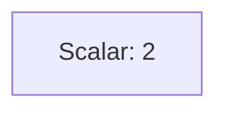
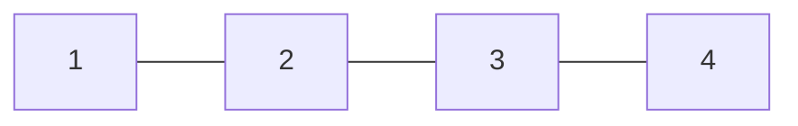
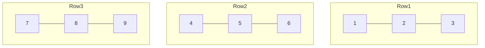

## Tensors: The Fundamental Data Structure in Machine Learning

Tensors are the **core data structure** in machine learning and deep learning.  
They serve as **multi-dimensional containers for numerical data**, generalizing scalars, vectors, and matrices to higher dimensions.

### Key Tensor Concepts

- **Rank (or Order):**  
  The number of dimensions (or axes) a tensor has.  
  - Formula: `rank = number of axes = number of dimensions`
  - Example:  
    - Scalar → Rank 0  
    - Vector → Rank 1  
    - Matrix → Rank 2  

- **Shape:**  
  A tuple that defines the size of each dimension in a tensor.  
  - Formula: `shape = number of elements along each dimension`
  - Example:  
    ```python
    np.array([[1, 2, 3], [4, 5, 6]]).shape  # (2, 3)
    ```

### Tensor Ranks and Examples

#### **0D Tensor (Scalar)**

A scalar is a single number — a tensor with zero dimensions.

```text
2
````



#### **1D Tensor (Vector)**

A 1D tensor is a one-dimensional array of numbers — a vector.

```text
[1, 2, 3, 4]
```

This represents a rank-1 tensor with shape `(4,)`.



#### **2D Tensor (Matrix)**

A 2D tensor is a table or grid of numbers — a matrix.

```text
[[1, 2, 3],
 [4, 5, 6],
 [7, 8, 9]]
```

This represents a rank-2 tensor with shape `(3, 3)`.



#### **ND Tensors**

A tensor can have any number of dimensions (`N` dimensions).

| Tensor Type   | Example                                            | Shape                                           |
| ------------- | -------------------------------------------------- | ----------------------------------------------- |
| **3D Tensor** | Sequence of images (e.g., 10 images of size 28×28) | `(10, 28, 28)`                                  |
| **4D Tensor** | Batch of RGB images                                | `(batch_size, height, width, channels)`         |
| **5D Tensor** | Batch of videos                                    | `(batch_size, frames, height, width, channels)` |

### Real-world Applications of Tensors

| Tensor Type   | Real-world Analogy                                                 | Example Use Case                                     |
| ------------- | ------------------------------------------------------------------ | ---------------------------------------------------- |
| **1D Tensor** | Attributes of a single student                                     | `[CGPA, IQ, State, Placement Status]`                |
| **2D Tensor** | Dataset of multiple students (rows = students, columns = features) | College placement dataset                            |
| **3D Tensor** | Time series or sequential data                                     | Stock prices over time for multiple companies        |
| **4D Tensor** | Images                                                             | Batch of colored images (height × width × channels)  |
| **5D Tensor** | Videos                                                             | Batch of videos (frames × height × width × channels) |


### Code Examples

NumPy is a popular Python library for numerical computation and tensor manipulation.

```python
import numpy as np

# 0D Tensor (Scalar)
a = np.array(4)
print(a)
# Output: 4
print(a.ndim)   # 0
print(a.shape)  # ()

# 1D Tensor (Vector)
b = np.array([1, 2, 3, 4])
print(b)
# Output: [1 2 3 4]
print(b.ndim)   # 1
print(b.shape)  # (4,)

# 2D Tensor (Matrix)
c = np.array([[1, 2, 3], [4, 5, 6]])
print(c)
# Output:
# [[1 2 3]
#  [4 5 6]]
print(c.ndim)   # 2
print(c.shape)  # (2, 3)

# 3D Tensor (e.g., RGB images or stacked matrices)
d = np.array([
    [[1, 2], [3, 4]],
    [[5, 6], [7, 8]]
])
print(d)
# Output:
# [[[1 2]
#   [3 4]]
#  [[5 6]
#   [7 8]]]
print(d.ndim)   # 3
print(d.shape)  # (2, 2, 2)
```